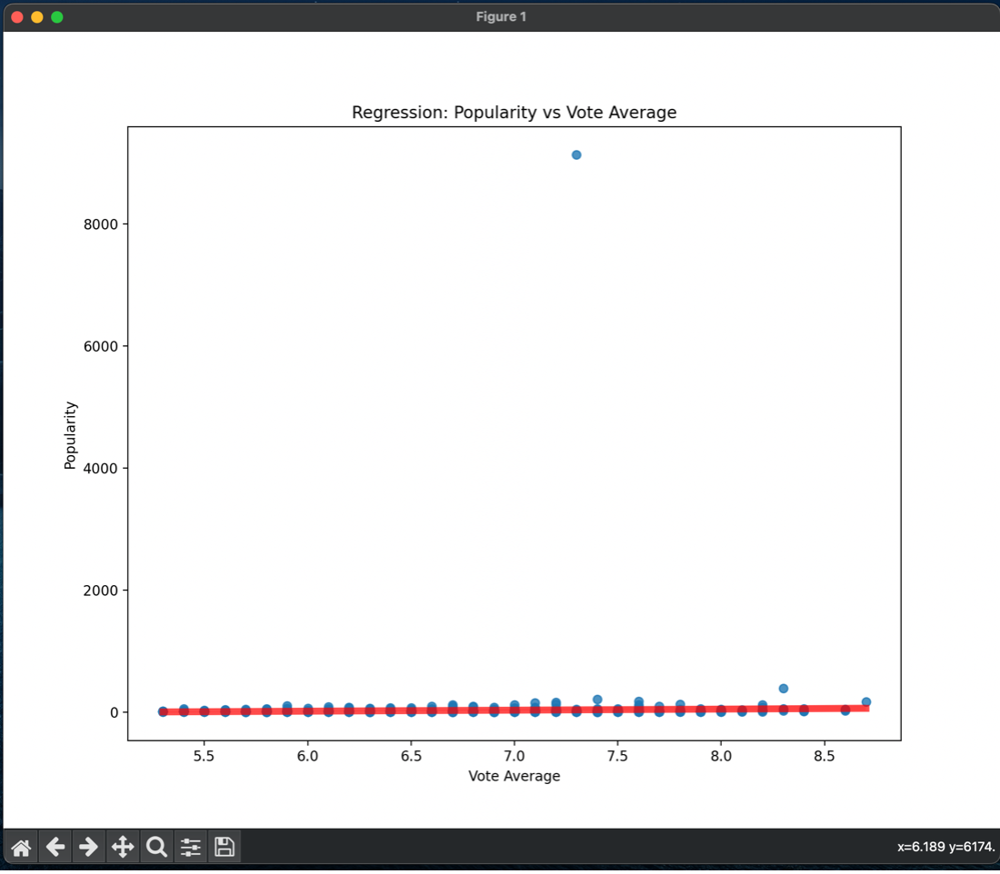
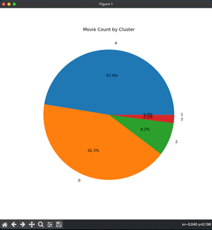

# TMDB Movie Dataset Analysis

This project analyzes the **TMDB 10,000 Movies Dataset** using Python.  
It covers data cleaning, clustering, regression, dimensionality reduction, and visualizations.

## Project Structure
- `data/` → contains the dataset
- `notebooks/` → Jupyter Notebook with code
- `src/` → Python script version
- `README.md` → project description

## How to Run
1. Install dependencies:  
   ```bash
   pip install -r requirements.txt
Run the notebook:

bash
Copy
Edit
jupyter notebook notebooks/analysis.ipynb
Techniques Used
Data Cleaning (missing values, duplicates, date parsing)
[TMDB 10000 Movies Dataset.csv](https://github.com/user-attachments/files/21818018/TMDB.10000.Movies.Dataset.csv)

KMeans Clustering

Linear Regression

PCA (Dimensionality Reduction)

Visualizations (scatter plots, regression plots, pie charts)

Dataset
Dataset: TMDB 10000 Movies Dataset (Kaggle).

## Sample Visualizations

### Clustering Plot


### Regression Plot


### Cluster Distribution


